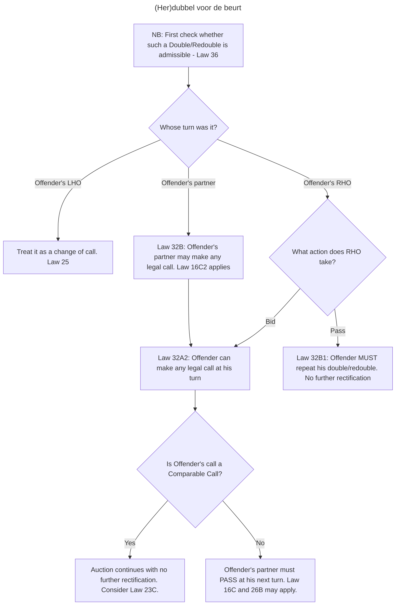

```mermaid
---
title: (Her)dubbel voor de beurt
---
graph TD
    Z[NB: First check whether such a Double/Redouble is admissible - Law 36] --> A
    A{Whose turn was it?}
    A -->|Offender's LHO| B[Treat it as a change of call. Law 25]
    A -->|Offender's partner| C[Law 32B: Offender's partner may make any legal call. Law 16C2 applies]
    C --> D[Law 32A2: Offender can make any legal call at his turn]
    A -->|Offender's RHO| E{What action does RHO take?}
    E -->|Bid| D
    E -->|Pass| F[Law 32B1: Offender MUST repeat his double/redouble. No further rectification]
    D --> G{Is Offender's call a Comparable Call?}
    G -->|Yes| H[Auction continues with no further rectification. Consider Law 23C.]
    G -->|No| I[Offender's partner must PASS at his next turn. Law 16C and 26B may apply.]
```
