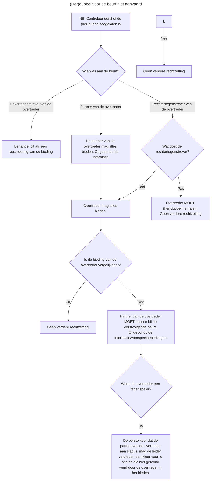

```mermaid
---
title: (Her)dubbel voor de beurt niet aanvaard
---
graph TD
    Z["NB: Controleer eerst of de (her)dubbel toegelaten is"] --> A
    A{Wie was aan de beurt?}
    A -->|Linkertegenstrever van de overtreder| B[Behandel dit als een verandering van de bieding]
    A -->|Partner van de overtreder| C[De partner van de overtreder mag alles bieden. Ongeoorloofde informatie]
    C --> D[Overtreder mag alles bieden.]
    A -->|Rechtertegenstrever van de overtreder| E{Wat doet de rechtertegenstrever?}
    E -->|Bod| D
    E -->|Pas| F["Overtreder MOET (her)dubbel herhalen. Geen verdere rechtzetting"]
    D --> G{Is de bieding van de overtreder vergelijkbaar?}
    G -->|Ja| H[Geen verdere rechtzetting.]
    G -->|Nee| I[Partner van de overtreder MOET passen bij de eerstvolgende beurt. Ongeoorloofde informatie/voorspeelbeperkingen.]-->J{Wordt de overtreder een tegenspeler?}
    J -->|Ja| K[De eerste keer dat de partner van de overtreder aan slag is, mag de leider verbieden een kleur voor te spelen die niet getoond werd door de overtreder in het bieden.]
    L -->|Nee| M[Geen verdere rechtzetting]
```
