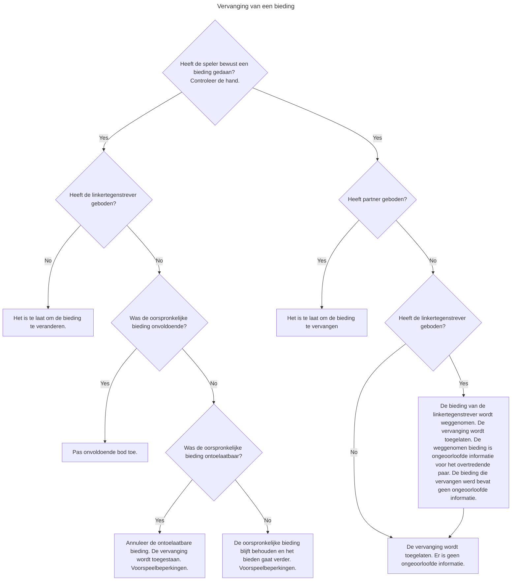

```mermaid
---
title: Vervanging van een bieding
---
graph TD
    A{Heeft de speler bewust een bieding gedaan? Controleer de hand.}
    A -->|Yes| B{Heeft de linkertegenstrever geboden?}
    B -->|No| C[Het is te laat om de bieding te veranderen.]
    B -->|No| D{Was de oorspronkelijke bieding onvoldoende?}
    D -->|Yes| E[Pas onvoldoende bod toe.]
    D -->|No| F{Was de oorspronkelijke bieding ontoelaatbaar?}
    F -->|Yes| G[Annuleer de ontoelaatbare bieding. De vervanging wordt toegestaan. Voorspeelbeperkingen.]
    F -->|No| H[De oorspronkelijke bieding blijft behouden en het bieden gaat verder. Voorspeelbeperkingen.]
    A -->|Yes| I{Heeft partner geboden?}
    I -->|Yes| J[Het is te laat om de bieding te vervangen]
    I -->|No| K{Heeft de linkertegenstrever geboden?}
    K -->|Yes| L[De bieding van de linkertegenstrever wordt weggenomen. De vervanging wordt toegelaten. De weggenomen bieding is ongeoorloofde informatie voor het overtredende paar. De bieding die vervangen werd bevat geen ongeoorloofde informatie.]
    K -->|No| M[De vervanging wordt toegelaten. Er is geen ongeoorloofde informatie.]
    L --> M
```
