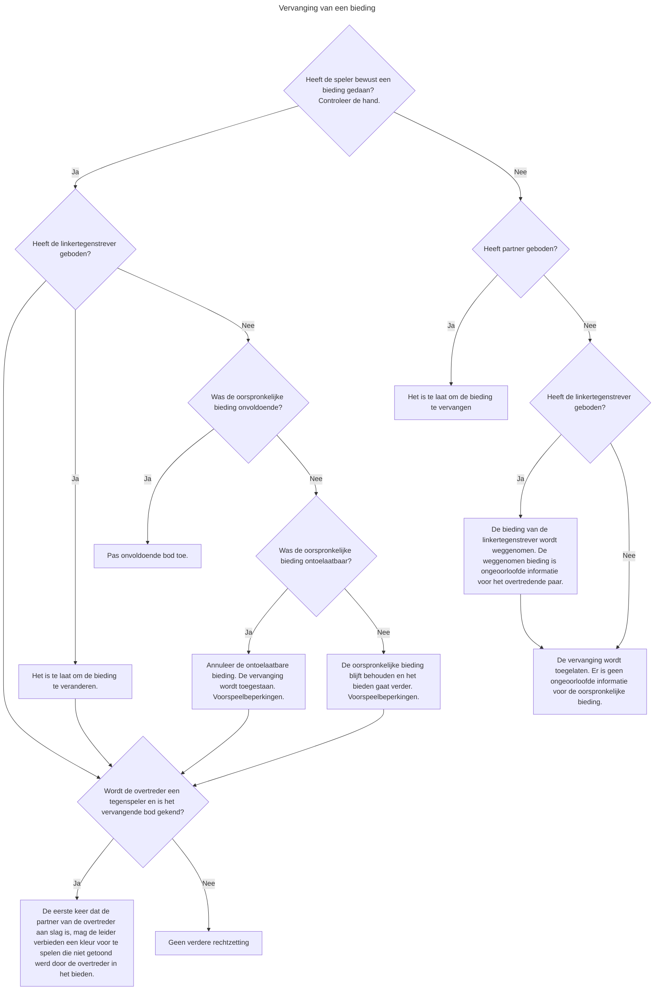

```mermaid
---
title: Vervanging van een bieding
---
graph TD
    A{Heeft de speler bewust een bieding gedaan? Controleer de hand.}
    A -->|Ja| B{Heeft de linkertegenstrever geboden?} -->N{Wordt de overtreder een tegenspeler en is het vervangende bod gekend?}
    B -->|Ja| C[Het is te laat om de bieding te veranderen.] -->N
    B -->|Nee| D{Was de oorspronkelijke bieding onvoldoende?}
    D -->|Ja| E[Pas onvoldoende bod toe.]
    D -->|Nee| F{Was de oorspronkelijke bieding ontoelaatbaar?}
    F -->|Ja| G[Annuleer de ontoelaatbare bieding. De vervanging wordt toegestaan. Voorspeelbeperkingen.] -->N
    F -->|Nee| H[De oorspronkelijke bieding blijft behouden en het bieden gaat verder. Voorspeelbeperkingen.] -->N
    A -->|Nee| I{Heeft partner geboden?}
    I -->|Ja| J[Het is te laat om de bieding te vervangen]
    I -->|Nee| K{Heeft de linkertegenstrever geboden?}
    K -->|Ja| L[De bieding van de linkertegenstrever wordt weggenomen. De weggenomen bieding is ongeoorloofde informatie voor het overtredende paar.]
    K -->|Nee| M[De vervanging wordt toegelaten. Er is geen ongeoorloofde informatie voor de oorspronkelijke bieding.]
    L --> M
    N -->|Ja| O[De eerste keer dat de partner van de overtreder aan slag is, mag de leider verbieden een kleur voor te spelen die niet getoond werd door de overtreder in het bieden.]
    N -->|Nee| P[Geen verdere rechtzetting]
```
