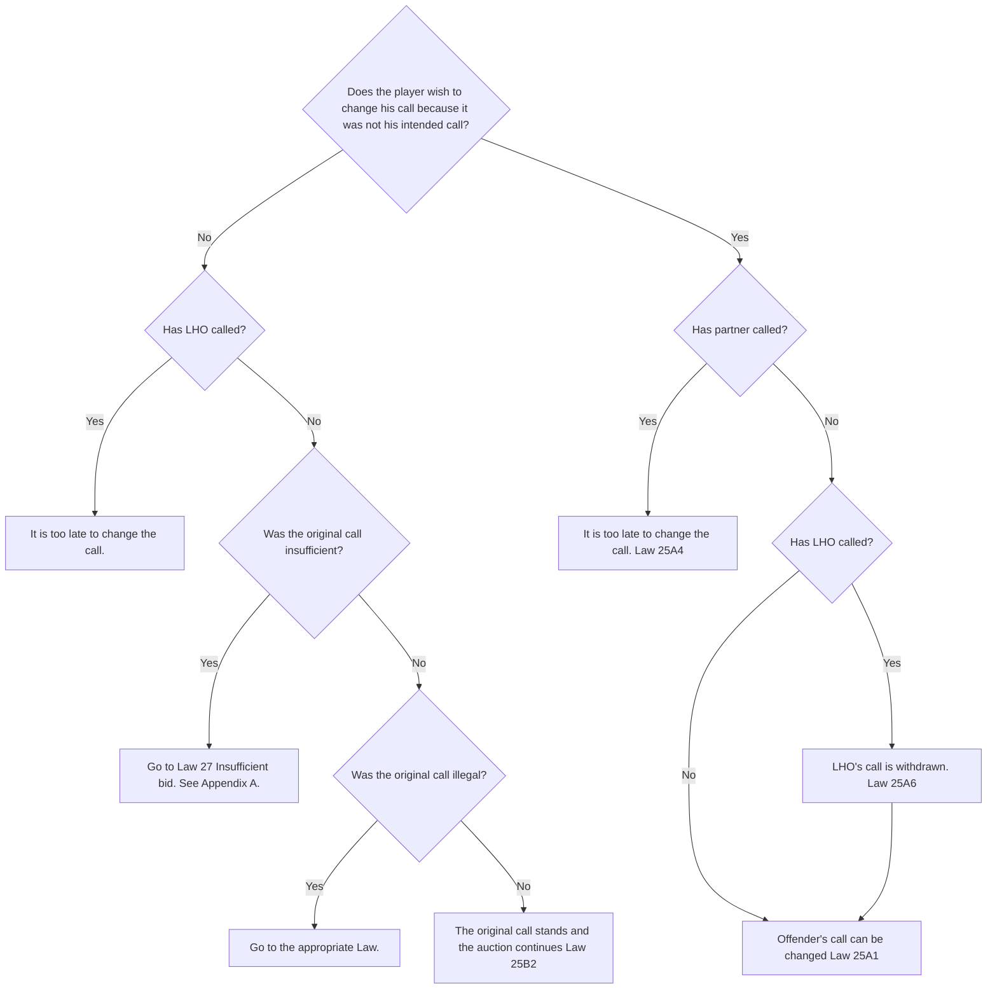

```mermaid
graph TD
    A{Does the player wish to change his call because it was not his intended call?}
    A -->|No| B{Has LHO called?}
    B -->|Yes| C[It is too late to change the call.]
    B -->|No| D{Was the original call insufficient?}
    D -->|Yes| E[Go to Law 27 Insufficient bid. See Appendix A.]
    D -->|No| F{Was the original call illegal?}
    F -->|Yes| G[Go to the appropriate Law.]
    F -->|No| H[The original call stands and the auction continues Law 25B2]
    A -->|Yes| I{Has partner called?}
    I -->|Yes| J[It is too late to change the call. Law 25A4]
    I -->|No| K{Has LHO called?}
    K -->|Yes| L[LHO's call is withdrawn. Law 25A6]
    K -->|No| M[Offender's call can be changed Law 25A1]
    L --> M
```
