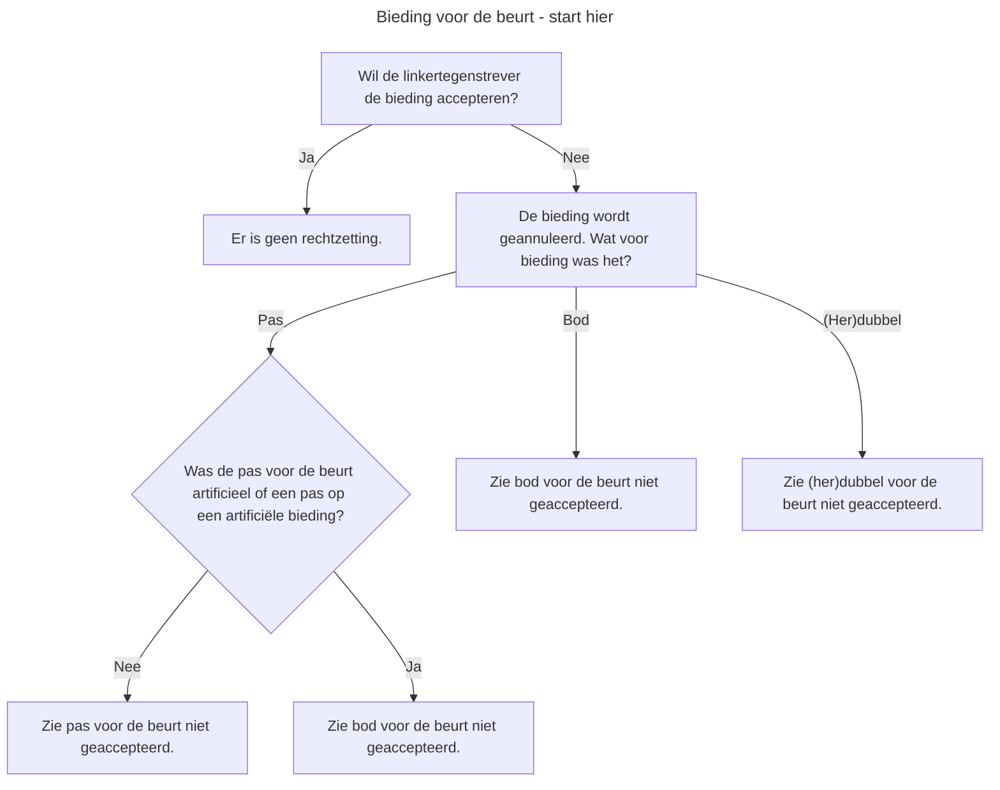

```mermaid
---
title: Bieding voor de beurt - start hier
---
graph TD
    A[Wil de linkertegenstrever de bieding accepteren?] -->|Ja| B[Er is geen rechtzetting.]
    A -->|Nee| C[De bieding wordt geannuleerd. Wat voor bieding was het?]
    C -->|Pas| D{Was de pas voor de beurt artificieel of een pas op een artificiële bieding?}
    D -->|Nee| E[Zie pas voor de beurt niet geaccepteerd.]
    D -->|Ja| F[Zie bod voor de beurt niet geaccepteerd.]
    C -->|Bod| G[Zie bod voor de beurt niet geaccepteerd.]
    C -->|"(Her)dubbel"| H["Zie (her)dubbel voor de beurt niet geaccepteerd."]
```
