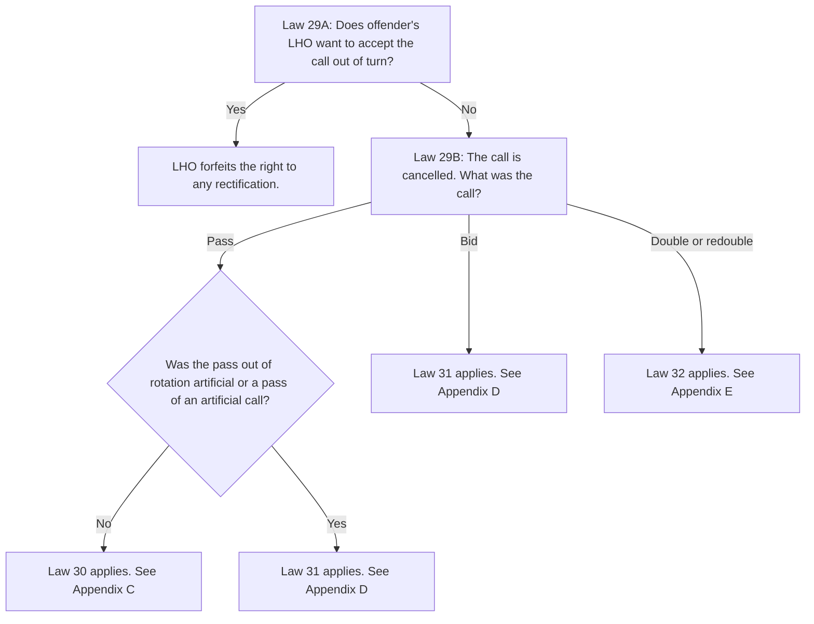

```mermaid
graph TD
    A[Law 29A: Does offender's LHO want to accept the call out of turn?] -->|Yes| B[LHO forfeits the right to any rectification.]
    A -->|No| C[Law 29B: The call is cancelled. What was the call?]
    C -->|Pass| D{Was the pass out of rotation artificial or a pass of an artificial call?}
    D -->|No| E[Law 30 applies. See Appendix C]
    D -->|Yes| F[Law 31 applies. See Appendix D]
    C -->|Bid| G[Law 31 applies. See Appendix D]
    C -->|Double or redouble| H[Law 32 applies. See Appendix E]
```
