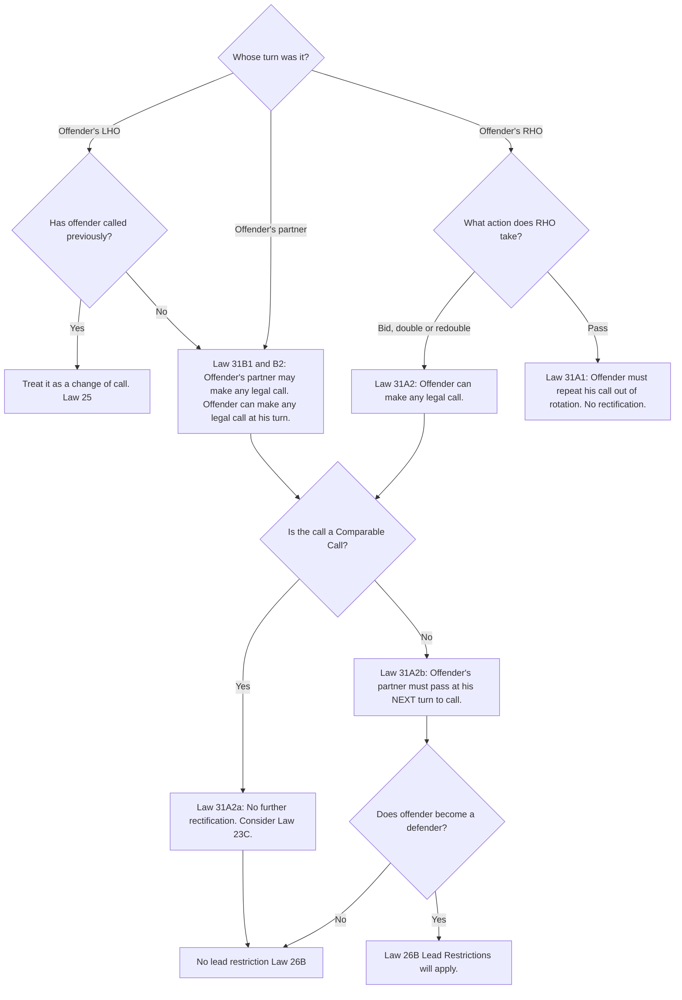

```mermaid
graph TD
    A{Whose turn was it?}
    A -->|Offender's LHO| B{Has offender called previously?}
    B -->|Yes| C[Treat it as a change of call. Law 25]
    B -->|No| D[Law 31B1 and B2: Offender's partner may make any legal call. Offender can make any legal call at his turn.]
    A -->|Offender's partner| D
    A -->|Offender's RHO| E{What action does RHO take?}
    E -->|Bid, double or redouble| F[Law 31A2: Offender can make any legal call.]
    E -->|Pass| G[Law 31A1: Offender must repeat his call out of rotation. No rectification.]
    D --> H{Is the call a Comparable Call?}
    F --> H
    H -->|Yes| I[Law 31A2a: No further rectification. Consider Law 23C.]
    I --> K[No lead restriction Law 26B]
    H -->|No| J[Law 31A2b: Offender's partner must pass at his NEXT turn to call.]
    J --> L{Does offender become a defender?}
    L -->|No| K
    L -->|Yes| M[Law 26B Lead Restrictions will apply.]
```
