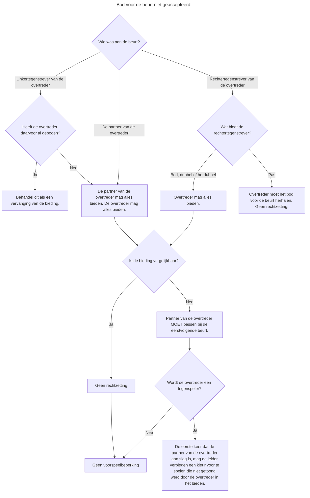

```mermaid
---
title: Bod voor de beurt niet geaccepteerd
---
graph TD
    A{Wie was aan de beurt?}
    A -->|Linkertegenstrever van de overtreder| B{Heeft de overtreder daarvoor al geboden?}
    B -->|Ja| C[Behandel dit als een vervanging van de bieding.]
    B -->|Nee| D[De partner van de overtreder mag alles bieden. De overtreder mag alles bieden.]
    A -->|De partner van de overtreder| D
    A -->|Rechtertegenstrever van de overtreder| E{Wat biedt de rechtertegenstrever?}
    E -->|Bod, dubbel of herdubbel| F[Overtreder mag alles bieden.]
    E -->|Pas| G[Overtreder moet het bod voor de beurt herhalen. Geen rechtzetting.]
    D --> H{Is de bieding vergelijkbaar?}
    F --> H
    H -->|Ja| I[Geen rechtzetting]
    I --> N[Geen voorspeelbeperking]
    H -->|Nee| J[Partner van de overtreder MOET passen bij de eerstvolgende beurt.]
    J --> L{Wordt de overtreder een tegenspeler?}
    L -->|Ja| M[De eerste keer dat de partner van de overtreder aan slag is, mag de leider verbieden een kleur voor te spelen die niet getoond werd door de overtreder in het bieden.]
    L -->|Nee| N
```
