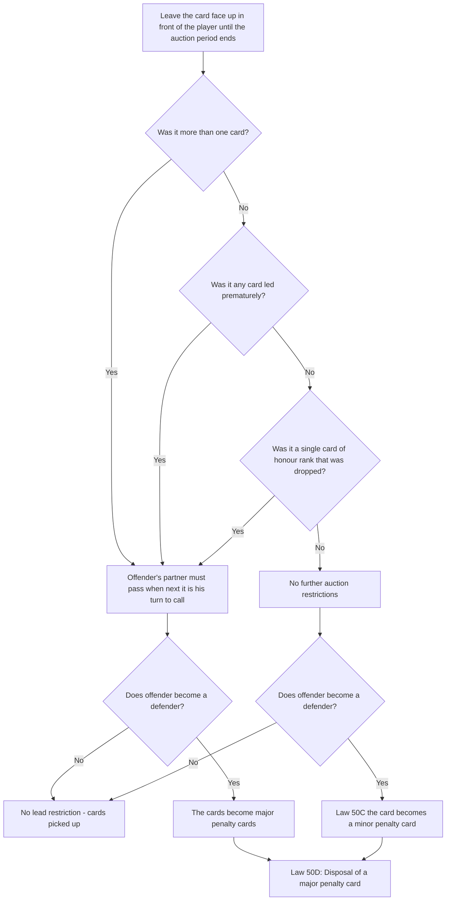

```mermaid
graph TD
    A[Leave the card face up in front of the player until the auction period ends] --> B{Was it more than one card?}
    B -->|No| C{Was it any card led prematurely?}
    C -->|No| D{Was it a single card of honour rank that was dropped?}
    B -->|Yes| E[Offender's partner must pass when next it is his turn to call]
    C -->|Yes| E
    D -->|Yes| E
    D -->|No| F[No further auction restrictions]
    E --> G{Does offender become a defender?}
    F --> H{Does offender become a defender?}
    G -->|No| I[No lead restriction - cards picked up]
    H -->|No| I
    G -->|Yes| J[The cards become major penalty cards]
    H -->|Yes| K[Law 50C the card becomes a minor penalty card]
    J --> L[Law 50D: Disposal of a major penalty card]
    K --> L
```
