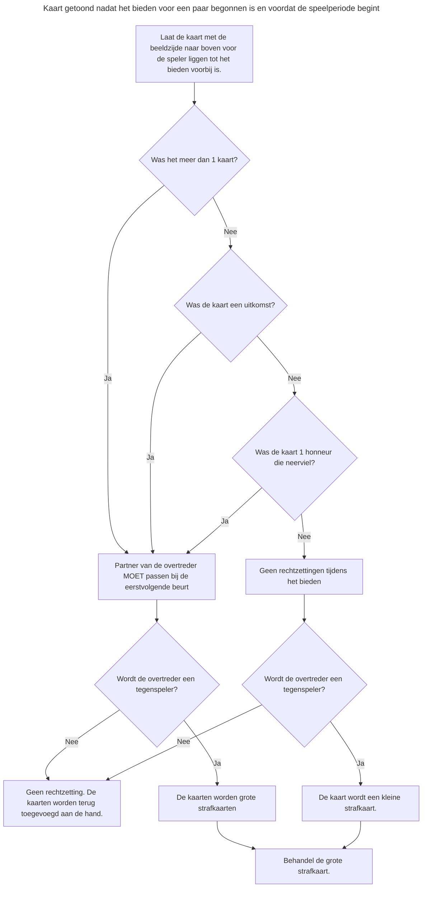

```mermaid
---
title: Kaart getoond nadat het bieden voor een paar begonnen is en voordat de speelperiode begint
---
graph TD
    A[Laat de kaart met de beeldzijde naar boven voor de speler liggen tot het bieden voorbij is.] --> B{Was het meer dan 1 kaart?}
    B -->|Nee| C{Was de kaart een uitkomst?}
    C -->|Nee| D{Was de kaart 1 honneur die neerviel?}
    B -->|Ja| E[Partner van de overtreder MOET passen bij de eerstvolgende beurt]
    C -->|Ja| E
    D -->|Ja| E
    D -->|Nee| F[Geen rechtzettingen tijdens het bieden]
    E --> G{Wordt de overtreder een tegenspeler?}
    F --> H{Wordt de overtreder een tegenspeler?}
    G -->|Nee| I[Geen rechtzetting. De kaarten worden terug toegevoegd aan de hand.]
    H -->|Nee| I
    G -->|Ja| J[De kaarten worden grote strafkaarten]
    H -->|Ja| K[De kaart wordt een kleine strafkaart.]
    J --> L[Behandel de grote strafkaart.]
    K --> L
```
