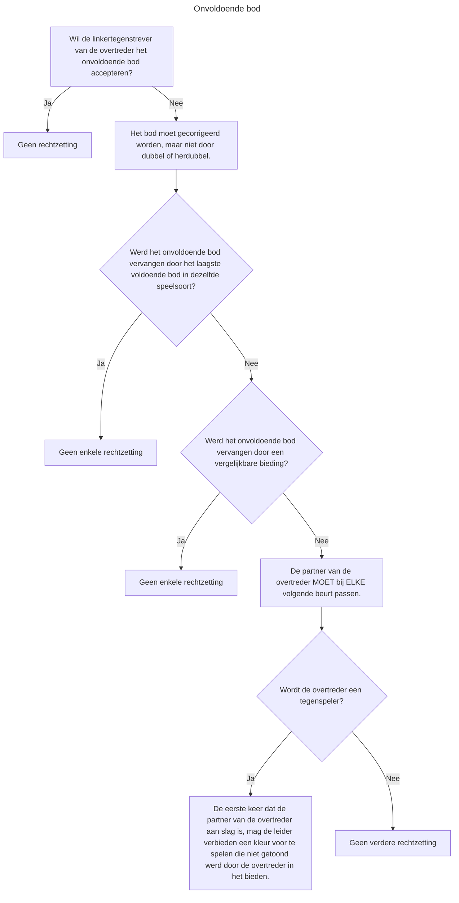

```mermaid
---
title: Onvoldoende bod
---
graph TD
    A[Wil de linkertegenstrever van de overtreder het onvoldoende bod accepteren?] -->|Ja| B[Geen rechtzetting]
    A -->|Nee| C[Het bod moet gecorrigeerd worden, maar niet door dubbel of herdubbel.]
    C --> D{Werd het onvoldoende bod vervangen door het laagste voldoende bod in dezelfde speelsoort?}
    D -->|Ja| E[Geen enkele rechtzetting]
    D -->|Nee| F{Werd het onvoldoende bod vervangen door een vergelijkbare bieding?}
    F -->|Ja| G[Geen enkele rechtzetting]
    F -->|Nee| H[De partner van de overtreder MOET bij ELKE volgende beurt passen.]
    H --> I{Wordt de overtreder een tegenspeler?}
    I -->|Ja| J[De eerste keer dat de partner van de overtreder aan slag is, mag de leider verbieden een kleur voor te spelen die niet getoond werd door de overtreder in het bieden.]
    I -->|Nee| K[Geen verdere rechtzetting]
```
