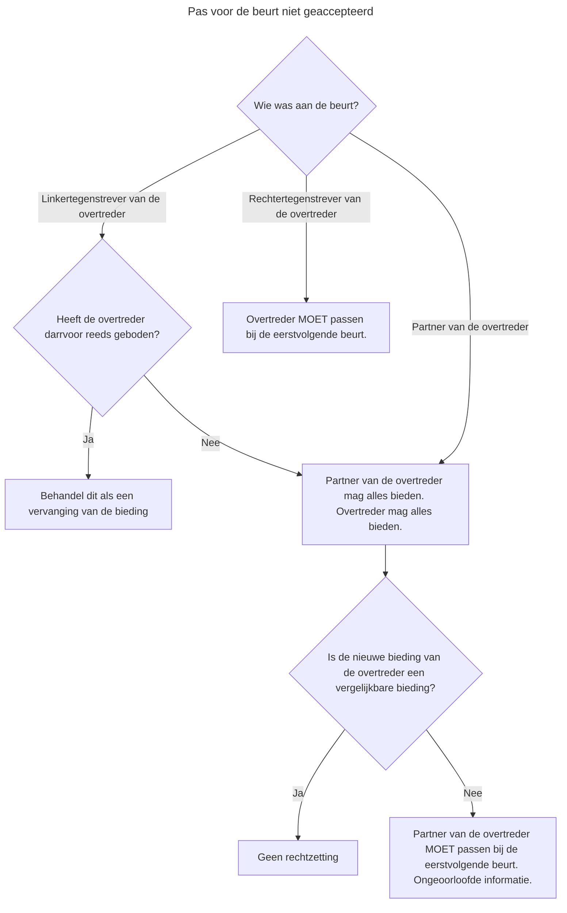

```mermaid
---
title: Pas  voor de beurt niet geaccepteerd
---
graph TD
    A{Wie was aan de beurt?}
    A -->|Linkertegenstrever van de overtreder| B{Heeft de overtreder darrvoor reeds geboden?}
    B -->|Ja| C[Behandel dit als een vervanging van de bieding]
    B -->|Nee| D[Partner van de overtreder mag alles bieden. Overtreder mag alles bieden.]
    A -->|Partner van de overtreder| D
    A -->|Rechtertegenstrever van de overtreder| E[Overtreder MOET passen bij de eerstvolgende beurt.]
    D --> F{Is de nieuwe bieding van de overtreder een vergelijkbare bieding?}
    F -->|Ja| G[Geen rechtzetting]
    F -->|Nee| H[Partner van de overtreder MOET passen bij de eerstvolgende beurt. Ongeoorloofde informatie.]
```
