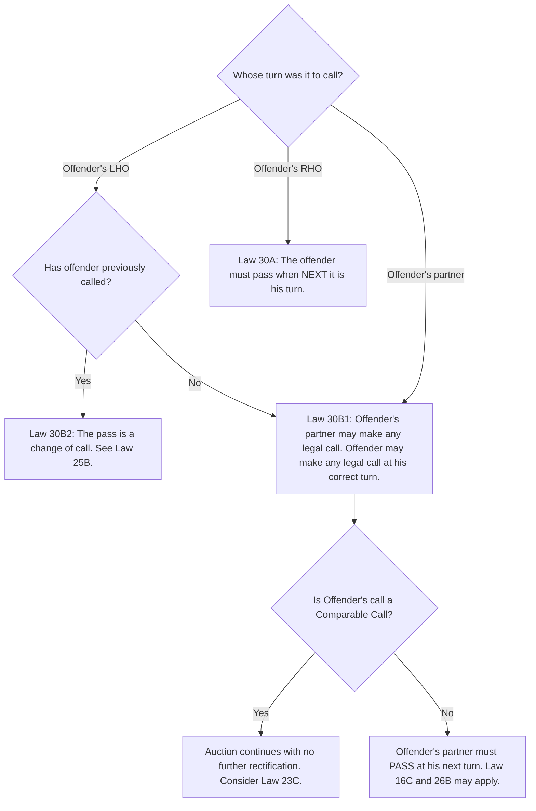

```mermaid
graph TD
    A{Whose turn was it to call?}
    A -->|Offender's LHO| B{Has offender previously called?}
    B -->|Yes| C[Law 30B2: The pass is a change of call. See Law 25B.]
    B -->|No| D[Law 30B1: Offender's partner may make any legal call. Offender may make any legal call at his correct turn.]
    A -->|Offender's partner| D
    A -->|Offender's RHO| E[Law 30A: The offender must pass when NEXT it is his turn.]
    D --> F{Is Offender's call a Comparable Call?}
    F -->|Yes| G[Auction continues with no further rectification. Consider Law 23C.]
    F -->|No| H[Offender's partner must PASS at his next turn. Law 16C and 26B may apply.]
```
