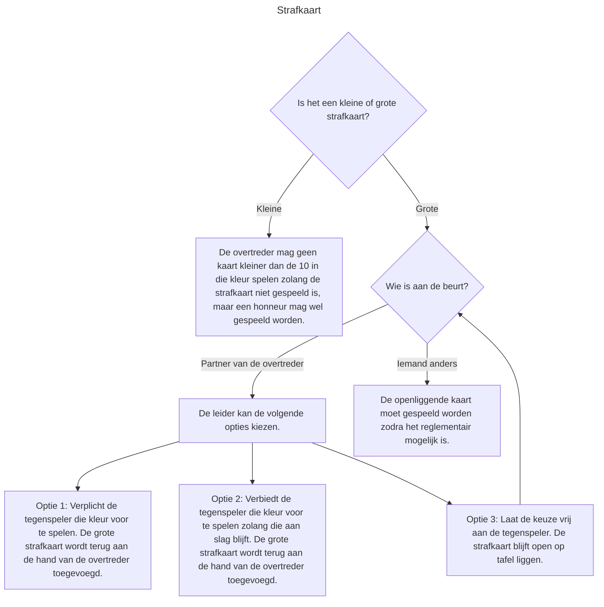

```mermaid
---
title: Strafkaart
---
graph TD
    A{Is het een kleine of grote strafkaart?}
    A -->|Kleine| B[De overtreder mag geen kaart kleiner dan de 10 in die kleur spelen zolang de strafkaart niet gespeeld is, maar een honneur mag wel gespeeld worden.]
    A -->|Grote| D{Wie is aan de beurt?}
    D -->|Partner van de overtreder| F[De leider kan de volgende opties kiezen.]
    D -->|Iemand anders| E[De openliggende kaart moet gespeeld worden zodra het reglementair mogelijk is.]
    F --> G[Optie 1: Verplicht de tegenspeler die kleur voor te spelen. De grote strafkaart wordt terug aan de hand van de overtreder toegevoegd.]
    F --> H[Optie 2: Verbiedt de tegenspeler die kleur voor te spelen zolang die aan slag blijft. De grote strafkaart wordt terug aan de hand van de overtreder toegevoegd.]
    F --> I[Optie 3: Laat de keuze vrij aan de tegenspeler. De strafkaart blijft open op tafel liggen.] -->D
```
