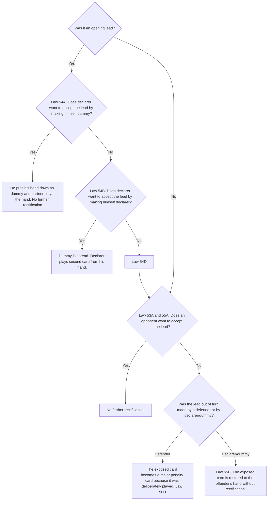

```mermaid
graph TD
    A{Was it an opening lead?}
    A -->|Yes| B{Law 54A: Does declarer want to accept the lead by making himself dummy?}
    B -->|Yes| C[He puts his hand down as dummy and partner plays the hand. No further rectification]
    B -->|No| D{Law 54B: Does declarer want to accept the lead by making himself declarer?}
    D -->|Yes| E[Dummy is spread. Declarer plays second card from his hand.]
    D -->|No| F[Law 54D]
    F --> G
    A -->|No| G{Law 53A and 55A: Does an opponent want to accept the lead?}
    G -->|Yes| H[No further rectification.]
    G -->|No| I{Was the lead out of turn made by a defender or by declarer/dummy?}
    I -->|Defender| J[The exposed card becomes a major penalty card because it was deliberately played. Law 50D]
    I -->|Declarer/dummy| K[Law 55B: The exposed card is restored to the offender's hand without rectification.]
```
