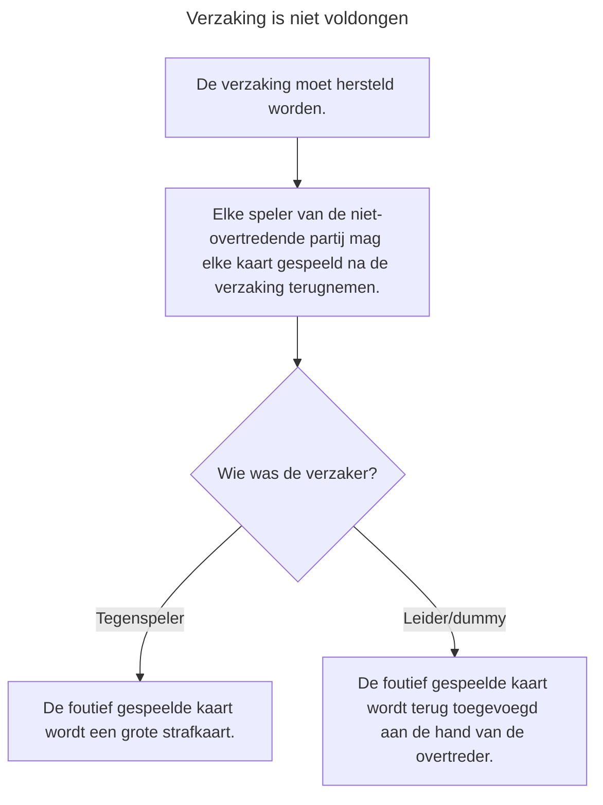

```mermaid
---
title: Verzaking is niet voldongen
---
graph TD
    A[De verzaking moet hersteld worden.] --> B[Elke speler van de niet-overtredende partij mag elke kaart gespeeld na de verzaking terugnemen.]
    B --> C{Wie was de verzaker?}
    C -->|Tegenspeler| D[De foutief gespeelde kaart wordt een grote strafkaart.]
    C -->|Leider/dummy| E[De foutief gespeelde kaart wordt terug toegevoegd aan de hand van de overtreder.]
```
