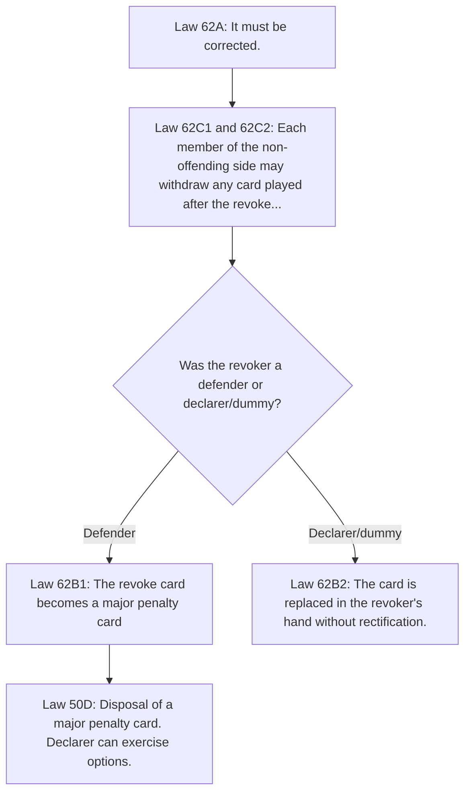

```mermaid
graph TD
    A[Law 62A: It must be corrected.] --> B[Law 62C1 and 62C2: Each member of the non-offending side may withdraw any card played after the revoke...]
    B --> C{Was the revoker a defender or declarer/dummy?}
    C -->|Defender| D[Law 62B1: The revoke card becomes a major penalty card]
    C -->|Declarer/dummy| E[Law 62B2: The card is replaced in the revoker's hand without rectification.]
    D --> F[Law 50D: Disposal of a major penalty card. Declarer can exercise options.]
```
