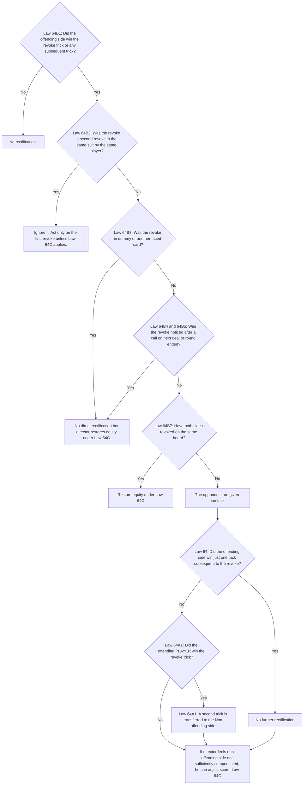

```mermaid
graph TD
    A{Law 64B1: Did the offending side win the revoke trick or any subsequent trick?}
    A -->|No| B[No rectification.]
    A -->|Yes| C{Law 64B2: Was the revoke a second revoke in the same suit by the same player?}
    C -->|Yes| D[Ignore it. Act only on the first revoke unless Law 64C applies.]
    C -->|No| E{Law 64B3: Was the revoke in dummy or another faced card?}
    E -->|Yes| F[No direct rectification but director restores equity under Law 64C.]
    E -->|No| G{Law 64B4 and 64B5: Was the revoke noticed after a call on next deal or round ended?}
    G -->|Yes| F
    G -->|No| H{Law 64B7: Have both sides revoked on the same board?}
    H -->|Yes| I[Restore equity under Law 64C]
    H -->|No| J[The opponents are given one trick.]
    J --> K{Law 64: Did the offending side win just one trick subsequent to the revoke?}
    K -->|Yes| L[No further rectification]
    K -->|No| M{Law 64A1: Did the offending PLAYER win the revoke trick?}
    M -->|Yes| N[Law 64A1: A second trick is transferred to the Non-offending side.]
    M -->|No| O[If director feels non-offending side not sufficiently compensated, he can adjust score. Law 64C]
    N --> O
    L --> O
```
