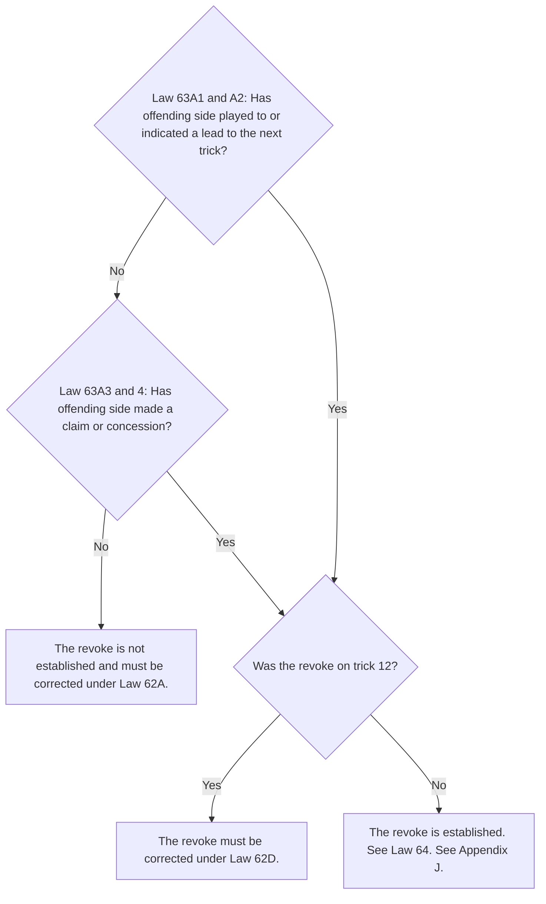

```mermaid
graph TD
    A{Law 63A1 and A2: Has offending side played to or indicated a lead to the next trick?}
    A -->|No| B{Law 63A3 and 4: Has offending side made a claim or concession?}
    B -->|No| C[The revoke is not established and must be corrected under Law 62A.]
    A -->|Yes| D{Was the revoke on trick 12?}
    B -->|Yes| D
    D -->|Yes| E[The revoke must be corrected under Law 62D.]
    D -->|No| F[The revoke is established. See Law 64. See Appendix J.]
```
