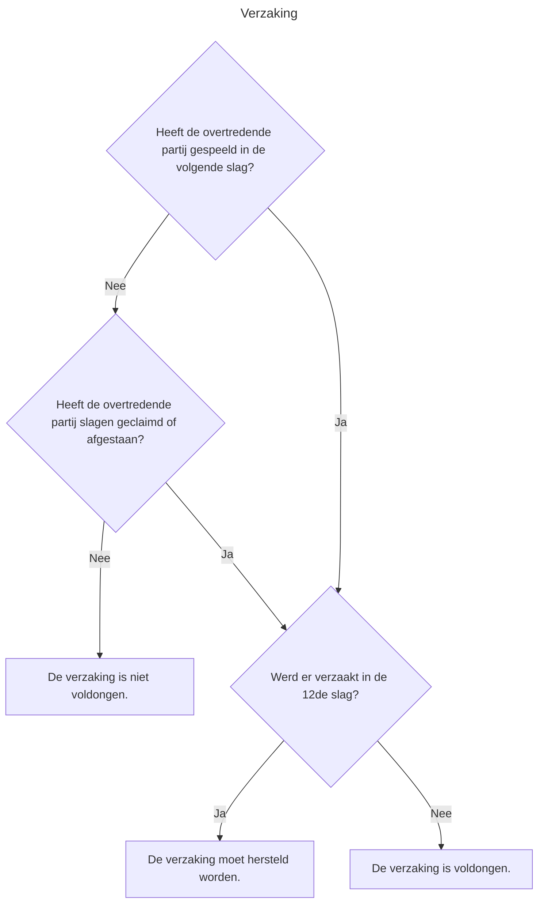

```mermaid
---
title: Verzaking
---
graph TD
    A{Heeft de overtredende partij gespeeld in de volgende slag?}
    A -->|Nee| B{Heeft de overtredende partij slagen geclaimd of afgestaan?}
    B -->|Nee| C[De verzaking is niet voldongen.]
    A -->|Ja| D{Werd er verzaakt in de 12de slag?}
    B -->|Ja| D
    D -->|Ja| E[De verzaking moet hersteld worden.]
    D -->|Nee| F[De verzaking is voldongen.]
```
