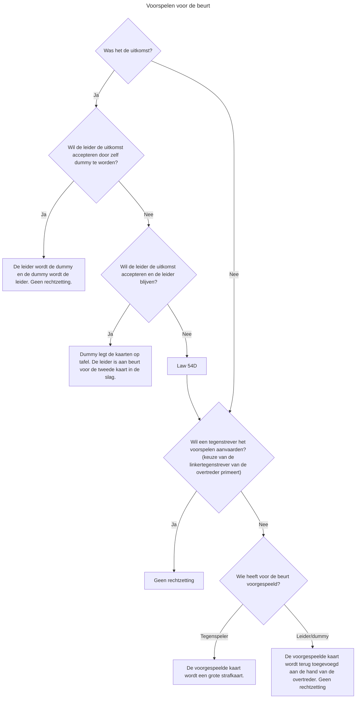

```mermaid
---
title: Voorspelen voor de beurt
---
graph TD
    A{Was het de uitkomst?}
    A -->|Ja| B{Wil de leider de uitkomst accepteren door zelf dummy te worden?}
    B -->|Ja| C[De leider wordt de dummy en de dummy wordt de leider. Geen rechtzetting.]
    B -->|Nee| D{Wil de leider de uitkomst accepteren en de leider blijven?}
    D -->|Ja| E[Dummy legt de kaarten op tafel. De leider is aan beurt voor de tweede kaart in de slag.]
    D -->|Nee| F[Law 54D]
    F --> G
    A -->|Nee| G{"Wil een tegenstrever het voorspelen aanvaarden? (keuze van de linkertegenstrever van de overtreder primeert)"}
    G -->|Ja| H[Geen rechtzetting]
    G -->|Nee| I{Wie heeft voor de beurt voorgespeeld?}
    I -->|Tegenspeler| J[De voorgespeelde kaart wordt een grote strafkaart.]
    I -->|Leider/dummy| K[De voorgespeelde kaart wordt terug toegevoegd aan de hand van de overtreder. Geen rechtzetting]
```
